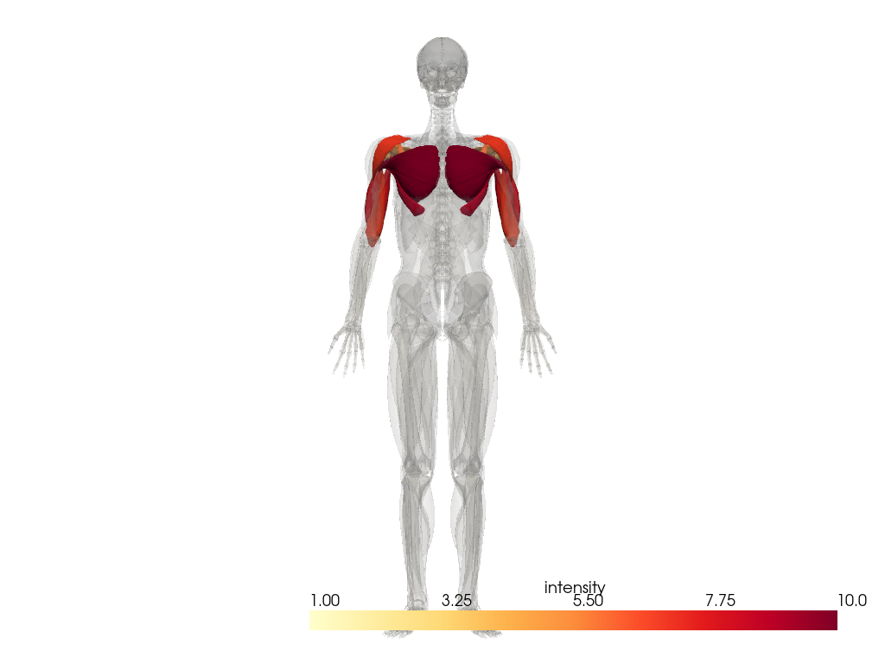
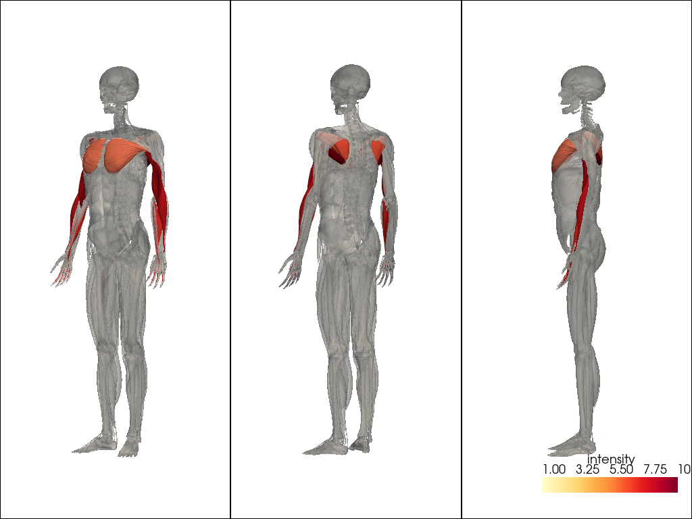
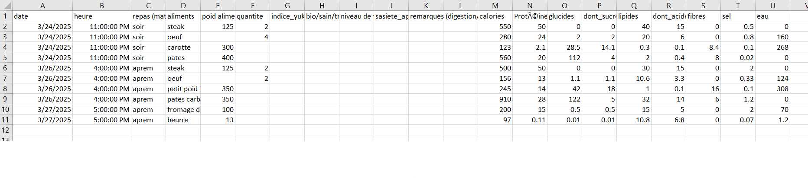

# 🏋️‍♂️ MuscleTrack - Outil de Suivi Sportif Local

**MuscleTrack** est une application locale de suivi sportif tout-en-un, pensée pour les passionnés de sport souhaitant optimiser leur **préparation physique**, leur **alimentation**, leur **hydratation** et leur **sommeil**.  
L'objectif principal est de visualiser et **analyser les performances physiques** à travers des **graphiques interactifs**, des **prédictions intelligentes**, et des **indicateurs visuels 3D des groupes musculaires travaillés**.

---

## 🚀 Fonctionnalités principales

### 📈 Suivi de la préparation physique
- Enregistrement des séances d'entraînement
- Graphiques :
  - **Charge soulevée par exercice dans le temps**
  - **Rythme d'entraînement / fréquence hebdomadaire**
  - **Nuage de mots des ressentis / notes post-séance**
  - **Volume total de répétitions par semaine**
  - **Répartition Push / Pull / Legs / Full Body**
  - **Camembert par groupe musculaire travaillé**
- Visualisation :
  - **Muscles activés en 3D** par exercice
  - **Équilibre global de l’entraînement**

---

## 🧍‍♂️ Visualisation 3D des muscles activés

### 🔹 Triceps à la barre EZ  

---

### 🔹 Squats  

---

### 🍽️ Suivi de l'alimentation
- Journal des repas avec analyse nutritionnelle
- Calcul automatique :
  - **Apports en Protéines, Lipides, Glucides, Calories, etc.**
  - **Détection des manques nutritionnels**
- Intégration possible avec **Yuka** pour noter les aliments
- **Suggestions de repas** équilibrés et variés pour la semaine

### 🔹 Suivi apport journalier API openai 

---

### 💧 Suivi santé
- Hydratation quotidienne
- Suivi du sommeil
- Corrélation possible entre forme physique et hygiène de vie

---

## 🔮 Objectifs avancés

- **Prédiction des performances** à partir des données d’entraînement
- **Recommandation intelligente** de routine (variations d'exos)
- Système de **visualisation dynamique et interactive**
- Interface simple et locale, utilisable sans cloud

---

## 🛠️ Technologies envisagées
- Python (interface locale + backend)
- Matplotlib / Plotly / Seaborn pour les graphiques
- Pandas / NumPy pour l’analyse des données
- Visualisation 3D avec BlenderAPI ou `plotly` 3D
- JSON / SQLite pour la sauvegarde des données

---

## 🔒 Données personnelles
Aucune donnée n’est envoyée en ligne. L’application fonctionne **en local**, sans besoin de connexion, garantissant une totale **confidentialité** des informations.

---

## 📌 Statut du projet
En cours de développement 🚧  
Le dépôt GitHub contiendra bientôt :
- Prototype de l’interface
- Fonctions de base pour l’enregistrement d’entraînement
- Premiers graphiques de suivi

---

## 🙋‍♂️ Objectif final
Offrir à chaque sportif une **vue complète de sa progression** et l’aider à **adapter son entraînement et son alimentation** pour atteindre ses objectifs plus efficacement, tout en restant maître de ses données.

---

